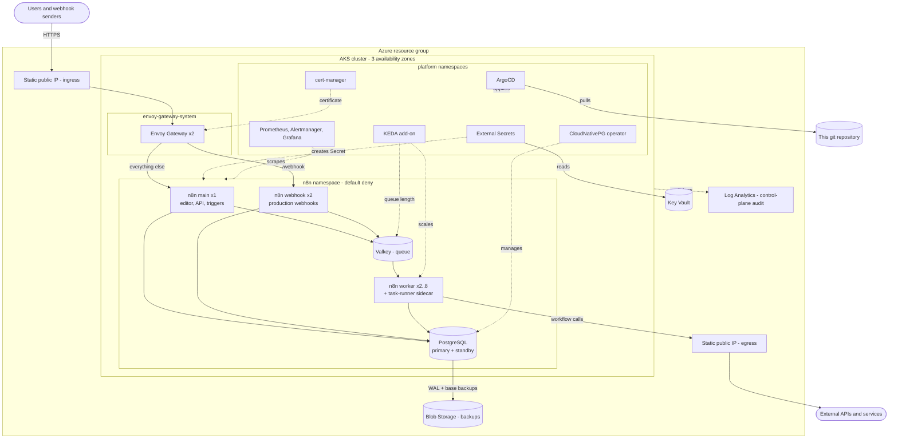
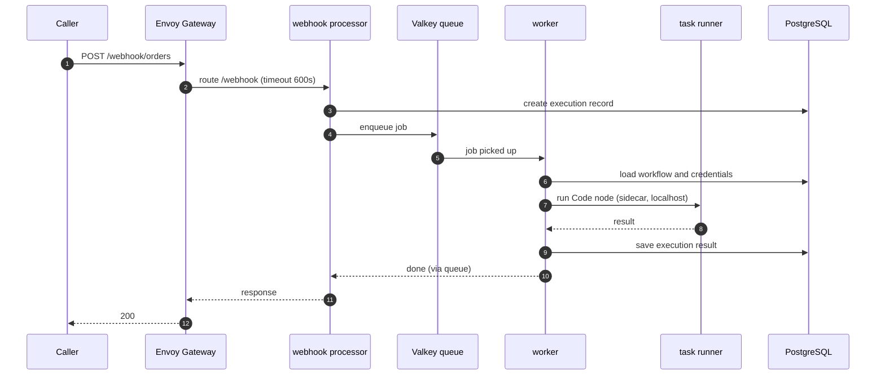
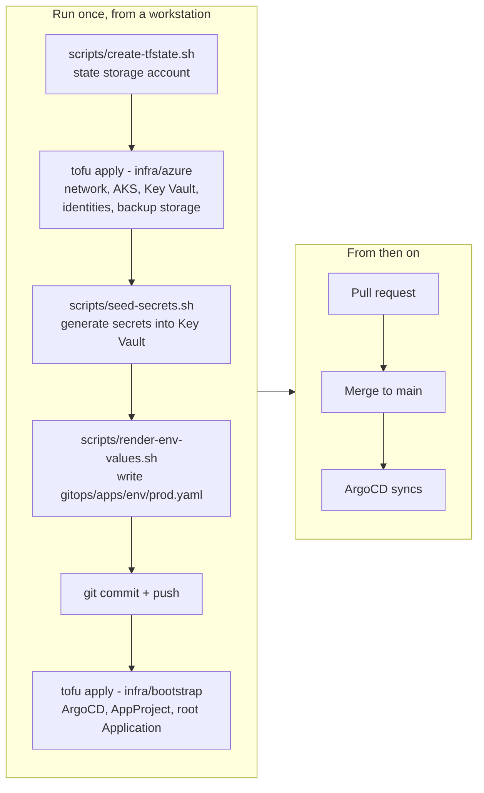
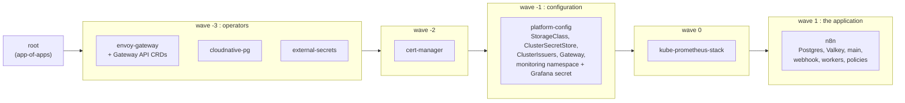
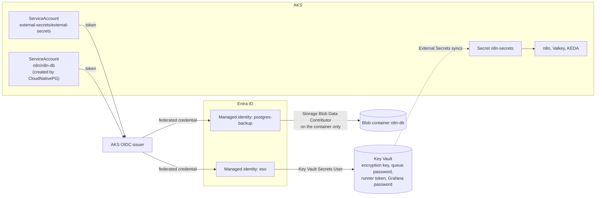
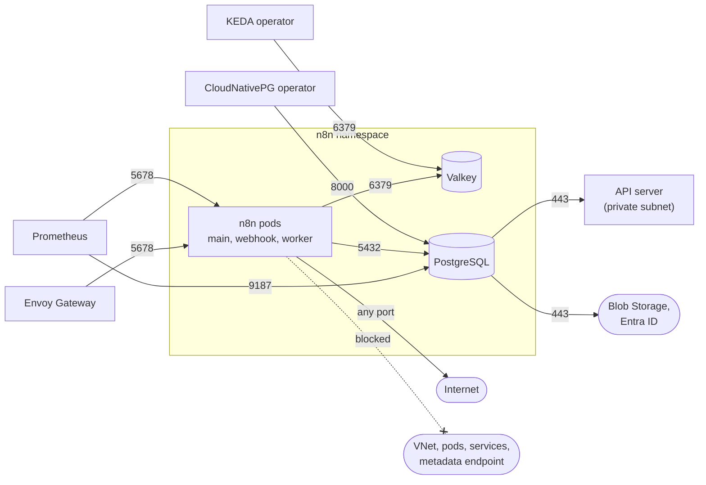
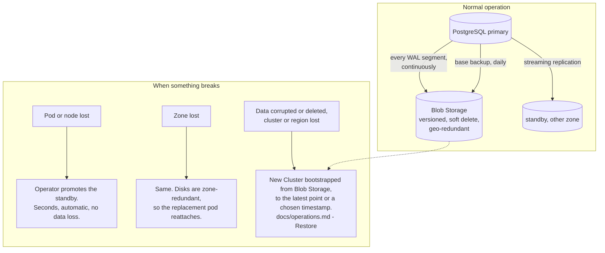

# n8n on AKS, GitOps

A complete, standalone production deployment of [n8n](https://n8n.io) on Azure
Kubernetes Service: OpenTofu creates the Azure side, ArgoCD delivers everything
inside the cluster from this repository.

n8n runs in **queue mode** — one main process, stateless webhook processors and
workers that scale on queue depth — on PostgreSQL with continuous backup, with
secrets in Key Vault and no long-lived credential anywhere.

| Concern | What this repository does |
|---|---|
| Compute | AKS, three zones, Azure CNI Overlay with the Cilium dataplane, Entra-only access (no local accounts) |
| n8n | Queue mode: main, webhook processors, KEDA-scaled workers, external task runners for Code nodes |
| Database | PostgreSQL 17 via CloudNativePG, primary + standby on zone-redundant disks |
| Backup | Continuous WAL archiving + daily base backup to Blob Storage, point-in-time restore |
| Queue | Valkey with an append-only file on a zone-redundant disk |
| Secrets | Key Vault → External Secrets, via workload identity. No secret in git or in OpenTofu state |
| Edge | Envoy Gateway (Gateway API) on a static public IP, TLS from Let's Encrypt |
| Network | Default-deny in the n8n namespace; workflows can reach the internet but not the cluster, the VNet or the metadata endpoint |
| Delivery | ArgoCD app-of-apps with ordered sync waves; every version pinned and tracked by Renovate |
| Observability | Prometheus, Alertmanager, Grafana; alert rules for n8n, the queue, the database and its backups; control-plane audit to Log Analytics |

## Architecture



### The three n8n processes

Queue mode splits n8n by job, so each part can fail and scale on its own.



The **main** process is the only one that is not horizontally scaled: it serves
the editor and fires schedule and polling triggers, and running two of them
needs n8n's multi-main mode, an Enterprise feature. While it restarts, the
editor is unavailable for a few seconds; production webhooks keep being
accepted and executed, because they never touch it.

## How it gets deployed

Two OpenTofu stacks and one commit. After that, git is the only interface.



ArgoCD then brings the cluster up in order. Each wave waits for the previous
one to be healthy:



The order is not cosmetic. cert-manager only enables Gateway API support if
the CRDs exist when it starts; the monitoring stack needs a Secret that the
configuration wave delivers; n8n needs all of it.

## Identity and secrets

No password, key or connection string is stored in git, in OpenTofu state, or
in a Kubernetes manifest. Pods prove who they are with their ServiceAccount
token, and Azure exchanges it for a short-lived Entra token.



One managed identity per consumer, each scoped to the one thing it needs.
ArgoCD has no Azure identity at all: it renders templates from repository
content and must not be able to trade that for a token.

The secret *values* are generated by `scripts/seed-secrets.sh` straight into
the vault. The database password never leaves the cluster — CloudNativePG
generates and owns it.

> **`n8n-encryption-key` is the one value that cannot be recreated.** It
> encrypts every credential stored in n8n. A database backup without it
> restores workflows whose credentials can never be decrypted. The vault has
> purge protection and 90-day soft delete for this reason; the seed script
> never overwrites an existing secret.

## Network policy

The n8n namespace is default-deny in both directions. These are the only paths
that exist:



A workflow is user-supplied logic that makes HTTP requests. Without the last
rule, anyone who can edit a workflow can probe the cluster network and ask the
node's metadata service for a token. Private destinations a workflow
legitimately needs are listed one by one in `networkPolicy.egressAllowedPrivate`.

## Backup and restore



What you need to rebuild from nothing: this repository, the blob container,
and the Key Vault.

## Repository layout

```
infra/
  azure/            Stack 1 - everything in Azure: network, AKS, Key Vault,
                    identities, backup storage, audit logging, budget
  bootstrap/        Stack 2 - ArgoCD, the AppProject and the root Application
gitops/
  apps/             App-of-apps: one ArgoCD Application per component
    env/prod.yaml   Generated from the Azure outputs; the only per-environment file
  platform-config/  StorageClass, ClusterSecretStore, ClusterIssuers, Gateway
  n8n/              The n8n chart: workloads, Postgres, Valkey, policies, alerts
scripts/            create-tfstate, seed-secrets, render-env-values
docs/               operations.md, local-rehearsal.md
```

## Deploying

**Prerequisites.** An Azure subscription where you can assign roles (Owner, or
Contributor plus Role Based Access Control Administrator); a DNS name you
control; and locally `az`, `kubelogin`, `kubectl`, `helm`, and `tofu`
(Terraform ≥ 1.9 also works — set `TF=terraform` for the scripts).

```bash
az login

# 1. State storage (once per subscription)
scripts/create-tfstate.sh <subscription-id>
#    -> paste the printed block into infra/azure/backend.hcl and
#       infra/bootstrap/backend.hcl (different `key` in each)

# 2. Azure
cd infra/azure
cp terraform.tfvars.example terraform.tfvars      # edit
tofu init -backend-config=backend.hcl
tofu apply
cd ../..

# 3. Secrets, generated straight into the vault
scripts/seed-secrets.sh "$(tofu -chdir=infra/azure output -raw key_vault_name)"

# 4. Hand the Azure outputs to the GitOps side
scripts/render-env-values.sh
git add gitops/apps/env/prod.yaml && git commit -m "prod environment values" && git push

# 5. DNS: point the hostname at the ingress IP (skip if dns_zone is set)
tofu -chdir=infra/azure output ingress_ip

# 6. ArgoCD
cd infra/bootstrap
cp terraform.tfvars.example terraform.tfvars      # edit
tofu init -backend-config=backend.hcl
tofu apply
```

Watch it converge:

```bash
az aks get-credentials -g <resource-group> -n <cluster-name>
kubectl -n argocd get applications -w
```

When every Application is `Synced` and `Healthy`, open `https://<your-host>`
and create the owner account. The certificate is from Let's Encrypt
**staging** at this point (browsers will warn): once it has been issued, set
`acme.issuer: letsencrypt-prod` in `gitops/apps/env/prod.yaml`, commit, and the
real certificate replaces it.

Day-2 procedures — upgrades, scaling, secret rotation, restore, alert routing —
are in [docs/operations.md](docs/operations.md).

## Design decisions

The non-obvious ones, each with the failure it prevents. The same reasoning is
in comments next to the code it applies to.

| Decision | Why |
|---|---|
| Zone-redundant disks for every stateful volume | The node pool spans three zones and the default disk class is zonal. A zonal disk pins its pod to one zone; when the autoscaler brings the replacement node up elsewhere, the pod sits `Pending` with no error on any controller. |
| API Server VNet Integration | Under default-deny, database pods need a route to the API server. With Cilium the `kubernetes` Service is translated before policy is evaluated, so the rule must name the API server's real address — which is only stable and private with this feature on. |
| `NODES_EXCLUDE` always carries n8n's two defaults | The variable replaces the default list instead of extending it. Excluding any other node without repeating them silently re-enables the node that runs shell commands in the pod. |
| Explicit timeout on every route | Envoy applies 15 s to the whole request on routes that declare none. A webhook that responds when the workflow finishes is cut with a 504 while the execution carries on. |
| API-defaulted fields written out in Gateway, HTTPRoute, ExternalSecret | A manifest that omits them leaves the Application permanently `OutOfSync` but `Healthy` — a state that hides real drift. |
| Cluster identity gets a role on the **egress** IP too | Creating the edge Service re-validates every frontend of the load balancer, including the outbound one. Without the role the Service stays at `<pending>` with a healthy controller. |
| Both public IPs have `prevent_destroy` | The address is the asset: DNS and third-party allow-lists point at it, and a recreated IP is a different number. |
| AppProject and root Application in separate Helm releases | Helm validates every object of a release against the cluster before applying any; a custom resource cannot ship in the release that installs its CRD. |
| Workers scale on waiting **and** active jobs | Backlog alone reads zero the moment workers pick the jobs up, and the pool would shrink under long-running executions. |
| `Recreate` for the main Deployment | A rolling update runs two mains side by side, and both fire every schedule trigger. |
| Secrets seeded by script, not by OpenTofu | Anything written through a resource is stored in state. |
| Federated credential on the ServiceAccount named after the database cluster | That is the account the backup actually runs under. Federating a hand-made "backup" account yields a cluster that tries to archive and fails authentication forever. |
| Code nodes run in a sidecar task runner | User code executes outside the process that holds the encryption key and the database connection. |

## Known limits

- **One main process.** Editor and trigger scheduling are not highly available
  without an n8n Enterprise licence (multi-main). Recovery from a node loss is
  a pod reschedule, typically under a minute.
- **One Valkey instance.** While it restarts, new executions cannot be queued.
  Queued jobs survive on disk. Swap in a managed Redis if that window matters.
- **Binary data** in queue mode is kept in the database by n8n's default;
  S3-compatible external storage is an Enterprise feature. Large files moving
  through workflows grow the database — watch the volume alert.
- **Community packages** live in an emptyDir and are reinstalled on pod start;
  only n8n-verified packages are allowed by default.
- **Postgres backups use CloudNativePG's in-tree object-store support**, which
  upstream has deprecated in favour of the Barman Cloud plugin. It works with
  the pinned operator; the migration is noted in `gitops/n8n/templates/postgres.yaml`.

## What has been verified

| Checked | How |
|---|---|
| Both OpenTofu stacks | `tofu validate` (azurerm 4.x, helm 3.x, kubernetes 3.x) |
| All charts | `helm lint`, rendered and validated against Kubernetes and CRD schemas |
| The n8n chart, running | Deployed on a local k3s cluster under `restricted` Pod Security and default-deny: a webhook call routed to the webhook processor, queued, executed by a worker through the task-runner sidecar and answered; 60 queued jobs scaled the workers from 1 to 3 through KEDA |
| The GitOps tree, running | ArgoCD bootstrapped on k3s the same way the bootstrap stack does it; all seven Applications reached `Synced` / `Healthy` in wave order, and n8n was served over HTTPS through Envoy Gateway with the declared timeouts present in Envoy's route table |

Not exercised, because it needs a real Azure subscription: `tofu apply`, Key
Vault through workload identity, the Azure load balancer and public IP
binding, Let's Encrypt issuance, backups to Blob Storage and the restore
procedure, and the monitoring stack. `make validate` runs everything in the
first two rows; [docs/local-rehearsal.md](docs/local-rehearsal.md) describes
the rest.

## License

MIT — see [LICENSE](LICENSE).
